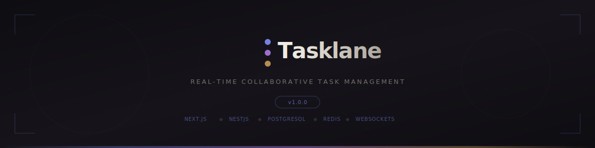

<div align="center">



<br/>

[](https://github.com/TanishqKatiyar/tasklane/actions)
[](https://www.typescriptlang.org/)
[](./LICENSE)
[](./CONTRIBUTING.md)

**A high-performance, real-time collaborative workspace for teams that treat shipping as a craft.**

<sub>Next.js 14 &middot; NestJS 10 &middot; PostgreSQL 16 &middot; Redis 7 &middot; WebSockets &middot; Prisma &middot; Zod</sub>

</div>


## The Philosophy

Most task managers are bloated databases wearing a productivity mask. They demand your attention instead of serving your workflow.

**Tasklane is different.** It is an opinionated, keyboard-first environment built on the principle of _editorial calm_ &#8212; stripping away noise to focus exclusively on the work itself. Engineered for sub-50ms interactions and zero-config real-time collaboration, it feels less like software and more like a precision instrument.


## Architecture

Tasklane is engineered as a **strictly-typed monorepo** with a clean separation of concerns. The frontend remains lightweight while the backend handles heavy computation and real-time synchronization.

```
tasklane/
├── apps/
│   ├── web/          # Next.js 14 — App Router, RSC, Zustand
│   └── api/          # NestJS 10 — REST + WebSocket Gateway
├── packages/
│   └── shared/       # Shared types, DTOs, Zod schemas
├── docker-compose.yml
└── package.json      # pnpm workspaces
```

### Tech Stack

<table>
<tr>
<td width="50%">

**Frontend** &mdash; `apps/web`

- Next.js 14 (App Router + Server Components)
- React 18 with Suspense boundaries
- Zustand for client state
- React Hook Form + Zod validation
- Custom "Paper & Ink" design system
- Framer Motion micro-animations

</td>
<td width="50%">

**Backend** &mdash; `apps/api`

- NestJS 10 (modular architecture)
- PostgreSQL 16 via Prisma ORM
- Redis 7 (caching, pub/sub, sessions)
- Socket.io real-time gateway
- Passport.js (JWT + OAuth2)
- Nodemailer + Mailhog (dev email)

</td>
</tr>
</table>

### Backend Modules

| Module          | Purpose                                                 |
| :-------------- | :------------------------------------------------------ |
| `auth`          | JWT authentication, token rotation, OAuth2 social login |
| `users`         | Profile management, avatar uploads, preferences         |
| `teams`         | Team CRUD, member invitations, role assignment          |
| `projects`      | Project lifecycle, archival, board configuration        |
| `tasks`         | Task CRUD, assignments, priority, status workflow       |
| `realtime`      | WebSocket gateway, presence tracking, live updates      |
| `notifications` | In-app + email notifications, digest scheduling         |
| `analytics`     | Team velocity, burn-down charts, productivity metrics   |
| `ai`            | AI-powered task suggestions and prioritization          |

### Frontend Pages

| Route        | Feature                                                   |
| :----------- | :-------------------------------------------------------- |
| `/dashboard` | Command center with stats, recent activity, quick actions |
| `/my-tasks`  | Personal task queue with filters and sorting              |
| `/projects`  | Project board with drag-and-drop columns                  |
| `/teams`     | Team management, member roles, invitations                |
| `/inbox`     | Notification center with read/unread states               |
| `/activity`  | Team-wide activity feed with real-time updates            |
| `/standup`   | Async standup notes and blockers                          |
| `/changelog` | Product changelog and release notes                       |
| `/settings`  | User preferences, theme, integrations                     |


## Quick Start

### Prerequisites

| Tool        | Version  | Purpose                    |
| :---------- | :------- | :------------------------- |
| **Node.js** | `>=20.x` | Runtime                    |
| **pnpm**    | `>=9.x`  | Package manager            |
| **Docker**  | Latest   | PostgreSQL, Redis, Mailhog |

### Setup

```bash
# 1. Clone the repository
git clone https://github.com/TanishqKatiyar/tasklane.git
cd tasklane

# 2. Install dependencies
pnpm install

# 3. Configure environment
cp .env.example .env
# Edit .env with your secrets (JWT, OAuth, DB credentials)

# 4. Boot infrastructure (PostgreSQL, Redis, Mailhog)
docker compose up -d

# 5. Run database migrations
pnpm --filter @tasklane/api prisma:migrate

# 6. Start development servers
pnpm dev
```

The frontend will be available at `http://localhost:3000` and the API at `http://localhost:4000`.


## Engineering Workflows

Our development lifecycle emphasizes code quality, strict typing, and zero-regression deployments.

```bash
pnpm dev           # Start all services concurrently (hot-reload)
pnpm build         # Production build (shared → api → web)
pnpm lint          # ESLint across all workspaces
pnpm lint:strict   # Zero-warning enforcement
pnpm typecheck     # tsc --noEmit (end-to-end type safety)
pnpm format        # Prettier formatting
pnpm format:check  # CI format validation
pnpm test          # Run test suites
pnpm test:cov      # Tests with coverage reports
```

### CI Pipeline

Every pull request triggers an automated quality gate:

```
Checkout → Install → Build Shared → Lint → Format Check → Typecheck
```

PostgreSQL and Redis service containers spin up automatically in CI. See [`.github/workflows/ci.yml`](./.github/workflows/ci.yml) for the full pipeline.

### Git Conventions

We enforce **Conventional Commits** for automated changelog generation:

```
feat(api): implement distributed rate limiting for auth endpoints
fix(web): resolve hydration mismatch on dashboard stats
chore(shared): update Zod schemas for task priority enum
```

Pre-commit hooks via Husky + lint-staged ensure every commit passes lint and format checks.


## Security

Security is a foundational feature, not an afterthought.

| Layer                | Implementation                                                     |
| :------------------- | :----------------------------------------------------------------- |
| **Authentication**   | Stateless JWT with sliding sessions, HTTP-only secure cookies      |
| **Authorization**    | Granular RBAC enforced at NestJS Guard level                       |
| **Input Validation** | All payloads validated via Zod schemas at the application boundary |
| **Database**         | Parameterized queries via Prisma, SSL connections                  |
| **Dependencies**     | Automated scanning via Dependabot and Snyk                         |
| **Secrets**          | Environment-based, never committed to source                       |

Found a vulnerability? Please read our [Security Policy](./SECURITY.md) for responsible disclosure.


## Design System

Tasklane ships with a custom **"Paper & Ink"** design system, inspired by editorial print and premium software aesthetics:

- **Dual Theme**: Warm near-black dark mode + cream ivory light mode
- **Typography**: Instrument Serif (display), Geist Sans (body), JetBrains Mono (code)
- **Motion**: Cinematic rise-in animations, aurora gradients, film-grain textures
- **Components**: Status pills, diamond dividers, edge tags, stat cards, skeleton loaders
- **Accessibility**: Focus-visible rings, skip-to-main links, reduced-motion support, semantic HTML


## Project Structure

```
tasklane/
├── .github/
│   ├── assets/              # SVG art for README
│   ├── workflows/ci.yml     # GitHub Actions pipeline
│   ├── ISSUE_TEMPLATE/      # Bug report + feature request forms
│   └── PULL_REQUEST_TEMPLATE.md
├── apps/
│   ├── api/
│   │   └── src/
│   │       ├── modules/     # auth, users, teams, projects, tasks,
│   │       │                # realtime, notifications, analytics, ai
│   │       ├── common/      # Guards, decorators, pipes, filters
│   │       ├── config/      # Environment validation
│   │       ├── prisma/      # Database client + migrations
│   │       └── email/       # Template engine + transporter
│   └── web/
│       └── src/
│           └── app/
│               ├── (auth)/  # Login, register, forgot password
│               └── (app)/   # Dashboard, projects, teams, inbox,
│                            # my-tasks, settings, activity, standup
├── packages/
│   └── shared/              # Types, DTOs, Zod schemas, constants
├── docker-compose.yml       # PostgreSQL 16 + Redis 7 + Mailhog
├── .editorconfig
├── .eslintrc.cjs
├── .prettierrc
├── tsconfig.base.json
├── CONTRIBUTING.md
├── SECURITY.md
└── LICENSE
```


## Contributing

We welcome contributions from engineers who align with our philosophy of quality. Review our [Contributing Guide](./CONTRIBUTING.md) for detailed guidelines on:

- Engineering standards and type safety requirements
- Branching strategy and naming conventions
- Commit message format (Conventional Commits)
- Pull request process and review expectations


## License

This project is licensed under the **MIT License** &#8212; see the [LICENSE](./LICENSE) file for details.

<div align="center">

<br/>


</div>
